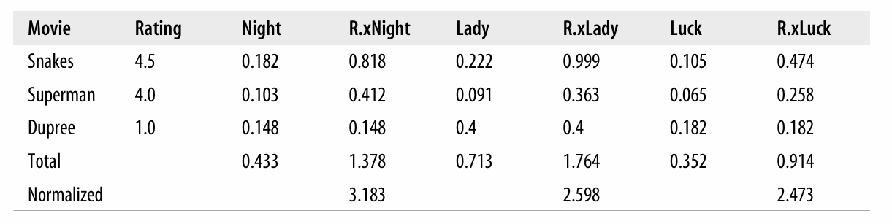

Hey This is me Learning ML(Collective Intelligence) using the book Programming Collective Intelligence by Toby Segaran.

Structure :
    All the functions are in functions.py
    The dataset is in recommendation.py
    run the functions using main.py

DAY 1: 
Understand what is Collective Intelligence.
Start building a movie recommndation program where it evaluates simillarity scores based on movie critic scores and users score and then recommends movies that user havent watched but may like based on his past movie reviews.

Pearson Corelation Score : 

$$ 
    r=\frac{n\sum xy-(\sum x)(\sum y)}{\sqrt{[n\sum x^{2}-(\sum x)^{2}][n\sum y^{2}-(\sum y)^{2}]}}
$$

Day something

See how changing the people with movies in product solves a very interesting probelm, 
say anyone wants to find similar movies based how different critics have scored the running the same simimalrity functions on inverted(transformed) pref dictionary actually helps finding this.
Also if anyone wants to find recommended critics for a new movie one can run getrecommendation function on the inverted(transformed) dictionary. Cool Stuff
Same can be done for Products in a grocerry think deeply.

Day something +1 

Exercise 1 

Tanimoto score 
Mainly used in chemoinfographics to check simililarity between molecules using molecular fingerprints.
Tanimoto coefficient is defined as Number of shared feautures devided by Total number of unique features present in both set

$$
T(x, y) =
\frac{\sum_{i=1}^{n} x_i y_i}
{\sum_{i=1}^{n} x_i^2 + \sum_{i=1}^{n} y_i^2 - \sum_{i=1}^{n} x_i y_i}
$$

Pearson Compares rating behavior good for user based filtering
Tanimoto compares audience overlap ration good for Item based filtering (can be used as 
say MovieA is liked(1) by (1,0,1,1,0) and MovieB have a vector(0,1,1,1,0) Tanimoto comapres based on this two vector how much similar is them.lets say C has a vector (1,0,0,1,1) then calculate the similarity of MovieA and MovieB with C and then you can say wheather to recommend MovieC or not to the user who liked A)

or We can use Tanimoto score to calculate similiarity between two people on the basis whether they have watched same (overlap) of movies or not 
or 
we can do vise versa for items wheather two movie is seen by same audience or not. 